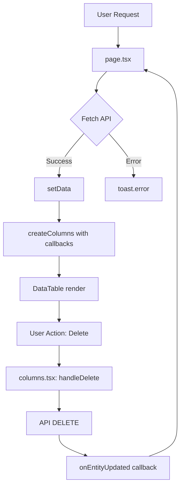

# DataTable Pattern - Arquitectura y Filosofía

Guía completa del patrón de 2 archivos para implementar tablas enterprise en el proyecto.

## 📋 Tabla de Contenidos

1. [Filosofía del Patrón](#filosofía-del-patrón)
2. [Arquitectura de 2 Archivos](#arquitectura-de-2-archivos)
3. [Responsabilidades](#responsabilidades)
4. [Flujo de Datos](#flujo-de-datos)
5. [Convenciones](#convenciones)
6. [Componentes Core](#componentes-core)
7. [Patrones Avanzados](#patrones-avanzados)
8. [Casos de Uso](#casos-de-uso)

---

## Filosofía del Patrón

### Principios Fundamentales

El sistema DataTable se basa en **separación clara de responsabilidades** mediante 2 archivos complementarios:

```
app/[entidad]/
  ├── columns.tsx    → CONTRACT + PRESENTATION
  │   ├─ Define TypeScript interfaces
  │   ├─ Configura estructura de columnas
  │   ├─ Implementa lógica de formateo
  │   └─ Maneja acciones por fila
  │
  └── page.tsx       → DATA + ORCHESTRATION
      ├─ Fetching de datos (API calls)
      ├─ Estado de loading/error
      ├─ Configuración de filtros
      └─ Callbacks para refetch
```

### ¿Por qué 2 Archivos?

| Beneficio                  | Explicación                                           |
| -------------------------- | ----------------------------------------------------- |
| **Separación de concerns** | Presentación (cómo se ve) vs Lógica (de dónde viene)  |
| **Reutilización**          | `createColumns()` puede usarse en múltiples contextos |
| **Type-safety**            | TypeScript end-to-end con interfaces compartidas      |
| **Testabilidad**           | Cada parte se testea de forma aislada                 |
| **Mantenibilidad**         | Cambios en formato no afectan lógica de negocio       |
| **Escalabilidad**          | Agregar columnas es trivial, no toca fetching         |

---

## Arquitectura de 2 Archivos

### Diagrama de Interacción

```
┌─────────────────────────────────────────────────────────────┐
│                     app/layout.tsx                          │
│  (Root Layout - Providers globales)                         │
│                                                             │
│  ├─ ThemeProvider                                           │
│  ├─ QueryProvider (TanStack Query)                          │
│  └─ ConfigurationProvider (país, moneda, locale)            │
└─────────────────────────────────────────────────────────────┘
                          ↓
┌─────────────────────────────────────────────────────────────┐
│                  app/projects/page.tsx                      │
│  (Data Orchestration)                                       │
│                                                             │
│  1. Fetch data from API                                     │
│  2. Manage loading state                                    │
│  3. Create columns with callbacks                           │
│  4. Configure filters                                       │
│  5. Render AppLayout + DataTable                            │
└─────────────────────────────────────────────────────────────┘
                          ↓
        ┌─────────────────────────────────────┐
        │   app/projects/columns.tsx          │
        │   (Structure Definition)            │
        │                                     │
        │   • TypeScript interface            │
        │   • ColumnDef<T>[] factory          │
        │   • Formateo functions              │
        │   • Actions component               │
        └─────────────────────────────────────┘
                          ↓
┌─────────────────────────────────────────────────────────────┐
│              components/data-table/data-table.tsx           │
│  (Rendering Engine)                                         │
│                                                             │
│  ├─ DataTableToolbar (search + filters)                     │
│  ├─ Table (TanStack Table)                                  │
│  │   ├─ Headers (sortable)                                  │
│  │   └─ Rows (mapped data)                                  │
│  └─ DataTablePagination                                     │
└─────────────────────────────────────────────────────────────┘
```

### Flujo de Responsabilidades



---

## Responsabilidades

### columns.tsx (Contract + Presentation)

#### ✅ Debe hacer:

1. **Definir el contrato de datos** (TypeScript interface)

   ```tsx
   export interface Project {
     id: string;
     projectNumber: string;
     customer: {
       id: string;
       name: string;
     };
     // ...
   }
   ```

2. **Configurar estructura de columnas** (ColumnDef array)

   ```tsx
   export const createColumns = (props) => [
     { accessorKey: 'name', header: 'Nombre', ... },
     { accessorKey: 'date', header: 'Fecha', ... },
   ]
   ```

3. **Implementar lógica de presentación**
   - Formateo de fechas, moneda, números
   - Badges con colores
   - Iconos y estados visuales

4. **Manejar acciones por fila**
   - Dropdowns de acciones
   - Confirmaciones
   - Navegación/modals

5. **Definir metadata de UI**

   ```tsx
   meta: {
     headerClassName: 'text-right',
     cellClassName: 'text-right',
   }
   ```

6. **Implementar lógica de filtrado custom**
   ```tsx
   filterFn: (row, id, filterValue) => {
     // Custom filter logic
   };
   ```

#### ❌ NO debe hacer:

- Fetching de datos (usa page.tsx)
- Estado global de la tabla (loading, error)
- Configuración de paginación
- Setup de providers

---

### page.tsx (Data + Orchestration)

#### ✅ Debe hacer:

1. **Fetching de datos**

   ```tsx
   const fetchProjects = async () => {
     const res = await fetch("/api/projects");
     const data = await res.json();
     setProjects(data);
   };
   ```

2. **Estado de loading/error**

   ```tsx
   const [isLoading, setIsLoading] = useState(true);
   ```

3. **Orquestar columnas**

   ```tsx
   const columns = createColumns({
     onProjectDeleted: fetchProjects,
     statuses: metadata?.statuses || [],
   });
   ```

4. **Configurar filtros**

   ```tsx
   const filterableColumns = [
     { id: 'status', title: 'Estado', options: [...] }
   ]
   ```

5. **Manejar callbacks de refetch**

   ```tsx
   const handleProjectDeleted = () => {
     fetchProjects();
   };
   ```

6. **Integrar con AppLayout**
   ```tsx
   <AppLayout
     pageTitle="Proyectos"
     action={<NewProjectDialog onSuccess={fetchProjects} />}
   >
     <DataTable ... />
   </AppLayout>
   ```

#### ❌ NO debe hacer:

- Definir estructura de columnas (usa columns.tsx)
- Lógica de formateo de celdas
- Componentes de acciones por fila
- Configuración de sorting

---

## Flujo de Datos

### 1. Initial Load

```
User → page.tsx
  ├─ useEffect(() => fetchProjects())
  ├─ API: GET /api/projects
  ├─ setProjects(data)
  ├─ createColumns({ onProjectDeleted, statuses })
  └─ <DataTable columns={columns} data={projects} />
```

### 2. User Interaction (Search)

```
User types in search → DataTableToolbar
  ├─ table.setGlobalFilter(value)
  └─ DataTable re-renders filtered rows
```

### 3. User Interaction (Delete)

```
User clicks Delete → ProjectActionsCell
  ├─ handleDelete() in columns.tsx
  ├─ API: DELETE /api/projects/:id
  ├─ onProjectDeleted() callback
  └─ page.tsx: fetchProjects() refetch
```

### 4. User Interaction (Edit Status)

```
User changes status → EditableBadge in column
  ├─ handleStatusChange(projectId, newStatusId)
  ├─ table.options.meta.handleStatusChange (passed from page.tsx)
  ├─ API: PUT /api/projects/:id
  └─ Update local state for optimistic UI
```

---

## Convenciones

### Alineación por Tipo de Dato

Tabla completa de convenciones de alineación:

| Tipo de Dato                       | Header        | Cell          | Justificación                          |
| ---------------------------------- | ------------- | ------------- | -------------------------------------- |
| **Texto** (nombres, descripciones) | `text-left`   | `text-left`   | Lectura natural izquierda→derecha      |
| **Números** (enteros, decimales)   | `text-right`  | `text-right`  | Alineación de unidades                 |
| **Moneda**                         | `text-right`  | `text-right`  | Convención contable universal          |
| **Fechas**                         | `text-center` | `text-center` | Dato compacto, centrado funciona mejor |
| **Badges/Estados**                 | `text-center` | `text-center` | Balance visual, peso igual             |
| **Booleanos** (checks)             | `text-center` | `text-center` | Checkbox/icon centrado                 |
| **Acciones** (dropdowns)           | `text-center` | `text-center` | Botón simétrico                        |
| **Compuesto** ($ + badge)          | `text-right`  | `text-right`  | El número domina, badge es decorativo  |
| **IDs**                            | `text-left`   | `text-left`   | Texto técnico, lectura izquierda       |
| **Emails**                         | `text-left`   | `text-left`   | Similar a texto                        |
| **Teléfonos**                      | `text-left`   | `text-left`   | Formato con código país (+56...)       |
| **Porcentajes solos**              | `text-right`  | `text-right`  | Es un número                           |
| **URLs**                           | `text-left`   | `text-left`   | Lectura izquierda                      |

### Ejemplo de Aplicación

```tsx
// ✅ CORRECTO: Número con badge (alineado derecha)
{
  accessorKey: 'totalPaid',
  header: 'Total Pagado',
  cell: ({ row }) => {
    const amount = row.original.totalPaid
    const percent = row.original.percentPaid

    return (
      <div className="flex items-center justify-end gap-2">
        <span>{formatCurrency(amount)}</span>
        <Badge>{percent}%</Badge>
      </div>
    )
  },
  meta: {
    headerClassName: 'text-right',
    cellClassName: 'text-right',
  },
}

// ✅ CORRECTO: Badge solo (centrado)
{
  accessorKey: 'status',
  header: 'Estado',
  cell: ({ row }) => <Badge>{row.getValue('status')}</Badge>,
  meta: {
    headerClassName: 'text-center',
    cellClassName: 'text-center',
  },
}
```

---

### Formateo Estandarizado

Todos los formateos deben usar las funciones centralizadas en `lib/format.ts`:

#### Fechas

```tsx
import { formatDate } from "@/lib/format";

// Short format: "15/01/2025"
formatDate(row.getValue("date"), "short", "es-CL");

// Long format: "15 de enero de 2025"
formatDate(row.getValue("date"), "long", "es-CL");

// Full format: "15 de enero de 2025, 14:30"
formatDate(row.getValue("date"), "full", "es-CL");
```

#### Moneda

```tsx
import { formatCurrency } from "@/lib/format";

// Con helper (recomendado)
formatCurrency(amount, "CLP"); // → "$1.234.567"
formatCurrency(amount, "USD"); // → "$1,234.56"

// Inline cuando necesitas config específica
new Intl.NumberFormat("es-CL", {
  style: "currency",
  currency: row.original.currency, // Dinámico desde data
  minimumFractionDigits: 0,
  maximumFractionDigits: 0,
}).format(amount);
```

#### Números

```tsx
import { formatNumber } from "@/lib/format";

// Con decimales
formatNumber(1234.567, 2); // → "1.234,57"

// Sin decimales
formatNumber(1234.567, 0); // → "1.235"
```

#### Porcentajes

```tsx
// Sin decimales (contexto compacto)
Math.round(percent) + "%"; // → "87%"

// Con 1 decimal (contexto detallado)
percent.toFixed(1) + "%"; // → "87.3%"
```

---

### Columnas Calculadas (accessorFn)

Para datos derivados que necesitan sorting y filtering:

```tsx
{
  id: 'projectState',
  accessorFn: (row) => {
    // Calcular valor derivado
    const isFullyPaid = row.balance === 0
    const hasFinalStatus = row.projectStatus?.isFinal ?? false
    return isFullyPaid && hasFinalStatus ? 'Finalizado' : 'Activo'
  },
  header: 'Estado Proyecto',
  cell: ({ row }) => {
    const state = row.getValue('projectState') as string
    const variant = state === 'Finalizado' ? 'success' : 'default'
    return <Badge variant={variant}>{state}</Badge>
  },
  filterFn: (row, id, value) => {
    return value.includes(row.getValue(id))
  },
  meta: {
    headerClassName: 'text-center',
    cellClassName: 'text-center',
  },
}
```

**Cuándo usar accessorFn:**

- Datos derivados de múltiples campos
- Cálculos que necesitan ser sortables/filtrables
- Transformaciones complejas

**Cuándo NO usar accessorFn:**

- Formateo simple (usar cell directamente)
- Datos que ya existen tal cual

---

### Metadata Pattern (Comunicación Column ↔ Page)

Para pasar callbacks y estado desde page.tsx a columns.tsx:

#### En page.tsx:

```tsx
const [updatingProjectId, setUpdatingProjectId] = useState<string | null>(null);

const handleStatusChange = async (projectId: string, newStatusId: string) => {
  setUpdatingProjectId(projectId);
  // ... lógica de update
  setUpdatingProjectId(null);
};

<DataTable
  columns={columns}
  data={projects}
  meta={{
    handleStatusChange, // ← Callback
    updatingProjectId, // ← Estado de UI
    // Más metadata...
  }}
/>;
```

#### En columns.tsx:

```tsx
cell: ({ row, table }) => {
  // Extraer desde meta
  const handleStatusChange = (table.options.meta as any)?.handleStatusChange;
  const updatingProjectId = (table.options.meta as any)?.updatingProjectId;

  const isPending = updatingProjectId === row.original.id;

  return (
    <EditableBadge
      value={row.original.status}
      onChange={(statusId) => handleStatusChange?.(row.original.id, statusId)}
      isPending={isPending}
    />
  );
};
```

**Ventajas:**

- No contamina props de columnas individuales
- Permite pasar funciones complejas
- State sincronizado automáticamente

---

## Componentes Core

### data-table.tsx (Orchestrator)

**Responsabilidad:** Configurar TanStack Table y renderizar estructura completa.

**Props principales:**

```tsx
interface DataTableProps<TData> {
  columns: ColumnDef<TData>[]; // Desde columns.tsx
  data: TData[]; // Desde page.tsx fetch

  // Búsqueda
  searchKey?: string; // Columna para búsqueda simple
  searchPlaceholder?: string;
  enableGlobalFilter?: boolean; // Búsqueda multi-columna
  globalFilterFn?: FilterFn<TData>; // Custom filter function

  // Filtros
  filterableColumns?: Array<{
    id: string;
    title: string;
    options: { label: string; value: string; bgClass?: string }[];
    onFilterChange?: (values: string[]) => void;
  }>;

  // Metadata
  meta?: TableMeta<TData>; // Para comunicación con columnas
}
```

**Estructura interna:**

```tsx
<div className="space-y-4">
  <DataTableToolbar
    table={table}
    searchKey={searchKey}
    enableGlobalFilter={enableGlobalFilter}
    filterableColumns={filterableColumns}
  />

  <div className="rounded-md border">
    <Table>
      <TableHeader>{/* Headers */}</TableHeader>
      <TableBody>{/* Rows */}</TableBody>
    </Table>
  </div>

  <DataTablePagination table={table} />
</div>
```

---

### data-table-toolbar.tsx (Filters Bar)

**Características:**

- Input de búsqueda con icono Search
- Filtros faceted (multi-select)
- Botón "Limpiar filtros"
- Dropdown "Columnas" (toggle visibility)

**Layout:**

```
┌────────────────────────────────────────────────────────┐
│ [🔍 Buscar...] [📊 Estado ▼] [💳 Método ▼] [Limpiar]   │
│                                        [👁️ Columnas ▼]  │
└────────────────────────────────────────────────────────┘
```

---

### data-table-column-header.tsx (Sortable Header)

**Características:**

- Dropdown con: Asc, Desc, Ocultar
- Solo renderiza si `column.getCanSort() === true`
- Iconos visuales (arrows) para sorting activo

**Uso:**

```tsx
{
  accessorKey: 'amount',
  header: ({ column }) => (
    <DataTableColumnHeader
      column={column}
      title="Monto"
      className="justify-end" // Para alinear derecha
    />
  ),
  cell: ({ row }) => formatCurrency(row.getValue('amount')),
}
```

---

### data-table-faceted-filter.tsx (Multi-Select Filter)

**Características:**

- Popover con Command (searchable)
- Multi-select con checkboxes
- Muestra count de cada opción (facets)
- Soporta `bgClass` para badges con color

**Ejemplo:**

```tsx
filterableColumns={[
  {
    id: 'projectStatus',
    title: 'Estado',
    options: [
      { label: 'Sin estado', value: 'null' },
      { label: 'En Proceso', value: 'id-1', bgClass: 'bg-blue-500' },
      { label: 'Completado', value: 'id-2', bgClass: 'bg-green-500' },
    ],
  },
]}
```

---

### data-table-dropdown.tsx (Row Actions)

**Wrapper para acciones por fila:**

```tsx
import { DataTableDropdown } from "@/components/data-table";
<DataTableDropdown>
  <DropdownMenuLabel>Acciones</DropdownMenuLabel>

  <DropdownMenuItem onClick={handleView}>
    <Eye className="mr-2 h-4 w-4" />
    Ver detalles
  </DropdownMenuItem>

  <DropdownMenuSeparator />

  <DropdownMenuItem className="text-destructive" onClick={handleDelete}>
    <Trash2 className="mr-2 h-4 w-4" />
    Eliminar
  </DropdownMenuItem>
</DataTableDropdown>;
```

---

## Patrones Avanzados

### 1. Global Filter Custom

Para búsqueda multi-campo:

```tsx
// En page.tsx
const globalFilterFn = (
  row: Row<Project>,
  _columnId: string,
  filterValue: string
) => {
  const project = row.original;
  const search = filterValue.toLowerCase();

  return (
    project.projectNumber.toLowerCase().includes(search) ||
    project.customer.name.toLowerCase().includes(search) ||
    (project.projectName && project.projectName.toLowerCase().includes(search))
  );
};

<DataTable
  columns={columns}
  data={projects}
  enableGlobalFilter={true}
  globalFilterFn={globalFilterFn}
  searchPlaceholder="Buscar por número, cliente o nombre..."
/>;
```

---

### 2. Filtro con Callback Externo

Para filtros que afectan el fetch (ej: cambiar API endpoint):

```tsx
// En page.tsx
const [projectState, setProjectState] = useState<'Activo' | 'Finalizado' | 'all'>('Activo')

const fetchProjects = useCallback(async () => {
  const res = await fetch(`/api/projects?state=${projectState}`)
  // ...
}, [projectState])

<DataTable
  filterableColumns={[
    {
      id: 'projectState',
      title: 'Estado Proyecto',
      options: [
        { label: 'Todos', value: 'all' },
        { label: 'Activos', value: 'Activo' },
        { label: 'Finalizados', value: 'Finalizado' },
      ],
      onFilterChange: (values) => {
        const newState = values.length > 0 ? values[0] : 'all'
        setProjectState(newState as 'Activo' | 'Finalizado' | 'all')
      },
    },
  ]}
/>
```

---

### 3. Columna con Estado Editable

Edición inline con optimistic UI:

```tsx
// En page.tsx
const [updatingProjectId, setUpdatingProjectId] = useState<string | null>(null)

const handleStatusChange = async (projectId: string, newStatusId: string) => {
  try {
    setUpdatingProjectId(projectId)

    await fetch(`/api/projects/${projectId}`, {
      method: 'PUT',
      body: JSON.stringify({ projectStatusId: newStatusId }),
    })

    // Optimistic UI update
    setProjects(prev => prev.map(p =>
      p.id === projectId ? { ...p, projectStatus: newStatus } : p
    ))

    toast.success('Estado actualizado')
  } finally {
    setUpdatingProjectId(null)
  }
}

// En columns.tsx
{
  accessorKey: 'projectStatus',
  header: 'Estado',
  cell: ({ row, table }) => {
    const handleStatusChange = (table.options.meta as any)?.handleStatusChange
    const updatingProjectId = (table.options.meta as any)?.updatingProjectId

    return (
      <EditableBadge
        value={row.original.projectStatus}
        options={statuses}
        onChange={(statusId) => handleStatusChange?.(row.original.id, statusId)}
        isPending={updatingProjectId === row.original.id}
      />
    )
  },
}
```

---

### 4. ActionsCell Separado (Best Practice)

**SIEMPRE** crear componente separado para acciones complejas:

```tsx
// En createColumns (LIMPIO)
{
  id: 'actions',
  cell: ({ row }) => (
    <ProjectActionsCell
      project={row.original}
      onProjectDeleted={onProjectDeleted}
    />
  ),
  meta: {
    headerClassName: 'text-center',
    cellClassName: 'text-center',
  },
}

// Componente separado AL FINAL del archivo
function ProjectActionsCell({
  project,
  onProjectDeleted,
}: {
  project: Project
  onProjectDeleted?: () => void
}) {
  // Estado local
  const [detailsOpen, setDetailsOpen] = useState(false)
  const [paymentsOpen, setPaymentsOpen] = useState(false)
  const [paymentDialogOpen, setPaymentDialogOpen] = useState(false)

  // Handlers
  const handleDelete = async () => {
    if (!confirm(`¿Seguro de eliminar ${project.projectNumber}?`)) return

    try {
      await fetch(`/api/projects/${project.id}`, { method: 'DELETE' })
      toast.success('Proyecto eliminado')
      onProjectDeleted?.()
    } catch (error) {
      toast.error('Error al eliminar')
    }
  }

  // Render
  return (
    <>
      <DataTableDropdown>
        <DropdownMenuLabel>Acciones</DropdownMenuLabel>

        <DropdownMenuItem onClick={() => setDetailsOpen(true)}>
          <Eye className="mr-2 h-4 w-4" />
          Ver detalles
        </DropdownMenuItem>

        <DropdownMenuItem onClick={() => setPaymentsOpen(true)}>
          <Receipt className="mr-2 h-4 w-4" />
          Ver pagos
        </DropdownMenuItem>

        <DropdownMenuItem onClick={() => setPaymentDialogOpen(true)}>
          <DollarSign className="mr-2 h-4 w-4" />
          Registrar pago
        </DropdownMenuItem>

        <DropdownMenuSeparator />

        <DropdownMenuItem className="text-destructive" onClick={handleDelete}>
          <Trash2 className="mr-2 h-4 w-4" />
          Eliminar
        </DropdownMenuItem>
      </DataTableDropdown>

      {/* Dialogs asociados */}
      <ViewProjectDetailsSheet
        projectId={project.id}
        open={detailsOpen}
        onOpenChange={setDetailsOpen}
      />

      <ViewProjectPaymentsDialog
        projectId={project.id}
        open={paymentsOpen}
        onOpenChange={setPaymentsOpen}
      />

      <PaymentToProjectDialog
        open={paymentDialogOpen}
        onOpenChange={setPaymentDialogOpen}
        preselectedProjectId={project.id}
        onSuccess={onProjectDeleted}
      />
    </>
  )
}
```

**Ventajas:**

- ✅ Array de columnas limpio y legible
- ✅ Componente con su propio estado (useState)
- ✅ Lógica compleja encapsulada
- ✅ Múltiples dialogs/sheets manejados
- ✅ Fácil de testear aisladamente

---

## Casos de Uso

### Caso 1: Tabla Simple (Solo Lectura)

```tsx
// columns.tsx
export interface Customer {
  id: string;
  name: string;
  email: string;
  phone: string;
}

export const createColumns = (): ColumnDef<Customer>[] => [
  {
    accessorKey: "name",
    header: "Nombre",
    meta: { headerClassName: "text-left", cellClassName: "text-left" },
  },
  {
    accessorKey: "email",
    header: "Email",
    meta: { headerClassName: "text-left", cellClassName: "text-left" },
  },
  {
    accessorKey: "phone",
    header: "Teléfono",
    meta: { headerClassName: "text-left", cellClassName: "text-left" },
  },
];

// page.tsx
export default function CustomersPage() {
  const [customers, setCustomers] = useState<Customer[]>([]);
  const [isLoading, setIsLoading] = useState(true);

  useEffect(() => {
    fetch("/api/customers")
      .then((res) => res.json())
      .then((data) => setCustomers(data))
      .finally(() => setIsLoading(false));
  }, []);

  const columns = createColumns();

  return (
    <AppLayout pageTitle="Clientes">
      {isLoading ? (
        <div>Cargando...</div>
      ) : (
        <DataTable
          columns={columns}
          data={customers}
          searchKey="name"
          searchPlaceholder="Buscar por nombre..."
        />
      )}
    </AppLayout>
  );
}
```

---

### Caso 2: Tabla con Filtros Faceted

```tsx
// page.tsx
const filterableColumns = [
  {
    id: 'type',
    title: 'Tipo',
    options: [
      { label: 'Proyecto', value: 'Project' },
      { label: 'Cliente', value: 'Customer' },
    ],
  },
  {
    id: 'paymentMethod',
    title: 'Método de Pago',
    options: paymentMethods.map(pm => ({
      label: pm.name,
      value: pm.id,
    })),
  },
]

<DataTable
  columns={columns}
  data={payments}
  searchKey="customer"
  filterableColumns={filterableColumns}
/>
```

---

### Caso 3: Tabla con Acciones CRUD

Ver ejemplo completo de `ProjectActionsCell` en [Patrones Avanzados](#4-actionscell-separado-best-practice).

---

### Caso 4: Tabla con Custom Rendering

```tsx
// columns.tsx
{
  accessorKey: 'projectNumber',
  header: 'Proyecto',
  cell: ({ row }) => {
    const project = row.original
    return (
      <ProjectNameSummary
        projectNumber={project.projectNumber}
        customerName={project.customer.name}
        projectName={project.projectName}
      />
    )
  },
  meta: { headerClassName: 'text-left', cellClassName: 'text-left' },
}
```

---

## Mejores Prácticas

### ✅ DO

1. **Siempre usar funciones de formato centralizadas** (`lib/format.ts`)
2. **Componente separado para acciones complejas**
3. **Meta para comunicación page ↔ columns**
4. **Convenciones de alineación consistentes**
5. **TypeScript interfaces exportadas**
6. **Callbacks para refetch después de mutaciones**
7. **Loading states explícitos**
8. **Confirmaciones para operaciones destructivas**

### ❌ DON'T

1. **NO hardcodear formateos inline** (usa helpers)
2. **NO poner lógica de acciones dentro del array de columnas**
3. **NO fetchear datos en columns.tsx**
4. **NO mezclar alineaciones sin razón**
5. **NO usar string literals para estados** (usa TypeScript unions)
6. **NO olvidar `meta.headerClassName` y `meta.cellClassName`**
7. **NO crear múltiples fuentes de verdad** (1 fetch, 1 estado)

---

### Handling Horizontal Overflow

**Problema:** Cuando tu DataTable tiene 8+ columnas, sin manejo correcto de overflow obtienes **scroll horizontal duplicado** (página completa + tabla).

**Solución:** SIEMPRE envolver DataTable con este patrón:

```tsx
// En page.tsx
import { Card, CardContent, CardHeader, CardTitle } from "@/components/ui/card";
<Card className="overflow-hidden">
  {" "}
  {/* ← Contiene el overflow */}
  <CardHeader>
    <CardTitle>Título de la Tabla</CardTitle>
  </CardHeader>
  <CardContent className="overflow-x-auto">
    {" "}
    {/* ← Permite scroll interno */}
    <DataTable columns={columns} data={data} />
  </CardContent>
</Card>;
```

**Cuándo aplicar:**

- ✅ Tu DataTable tiene 8+ columnas
- ✅ Columnas con contenido variable (nombres largos, descripciones)
- ✅ Múltiples columnas numéricas (precios, cantidades, porcentajes)
- ✅ Columnas de acciones (dropdowns, botones)

**Documentación detallada:** [data-table.md - Best Practices](data-table.md#handling-horizontal-overflow)

---

## Checklist de Implementación

Antes de considerar una tabla terminada:

- [ ] Interface TypeScript definida y exportada
- [ ] Todas las columnas tienen `meta` con alineación
- [ ] Fechas formateadas con `formatDate()`
- [ ] Moneda formateada con `formatCurrency()` o `Intl.NumberFormat`
- [ ] Acciones complejas en componente separado
- [ ] Callbacks `onUpdated` conectados para refetch
- [ ] Loading state implementado
- [ ] Breadcrumbs configurados en AppLayout
- [ ] Action button en AppLayout (ej: NewEntityDialog)
- [ ] Confirmación para operaciones destructivas
- [ ] Toast notifications para feedback
- [ ] Filtros configurados si aplica
- [ ] Search placeholder descriptivo

---

## Referencias

- **Guía práctica:** [create-new-datatable-page.md](../guides/create-new-datatable-page.md)
- **Componente base:** [data-table.md](data-table.md)
- **TanStack Table docs:** https://tanstack.com/table
- **Proyecto ejemplo:** `app/projects/` (implementación completa)

---

**Última actualización:** 2025-01-29
