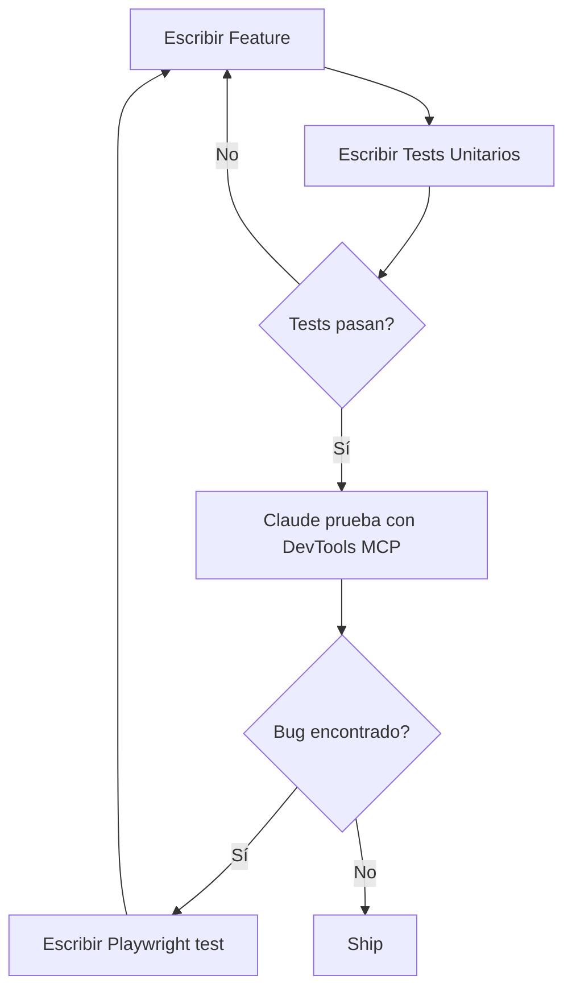

# Testing - Estrategia de Testing

Estrategia de testing implementada en este template.

## Stack de Testing

| Nivel                | Herramienta                           | Estado                 | Propósito                        |
| -------------------- | ------------------------------------- | ---------------------- | -------------------------------- |
| **Unit/Integration** | Vitest 3.2.4 + Testing Library 16.3.0 | ✅ Implementado        | Componentes, hooks, utils        |
| **E2E con IA**       | Playwright MCP                        | ✅ Implementado        | Testing con Claude, genera tests |
| **E2E Tradicional**  | @playwright/test                      | 📋 Recomendado agregar | CI/CD, cross-browser, regression |
| **Code Quality**     | ESLint 9 + Prettier                   | ✅ Implementado        | Linting y formatting             |

## Arquitectura de Testing

```
┌─────────────────────────────────────────┐
│     E2E Testing (Playwright MCP)        │  ← Testing con Claude
│     Status: Implementado ✅             │     (genera tests .spec.ts)
├─────────────────────────────────────────┤
│     E2E Testing (@playwright/test)      │  ← Regression, CI/CD
│     Status: Recomendado agregar 📋      │     (ejecuta tests)
├─────────────────────────────────────────┤
│     Integration Tests (Vitest)          │  ← Flujos multi-component
│     Status: Implementado ✅             │
├─────────────────────────────────────────┤
│     Unit Tests (Vitest)                 │  ← Componentes + Utils
│     Status: Implementado ✅             │
└─────────────────────────────────────────┘
```

---

## 1. Vitest + Testing Library (Implementado)

### Instalación

Ya incluido en el template:

```json
{
  "devDependencies": {
    "@testing-library/dom": "^10.4.1",
    "@testing-library/react": "^16.3.0",
    "@testing-library/user-event": "^14.5.2",
    "@vitejs/plugin-react": "^4.3.4",
    "jsdom": "^27.0.0",
    "vitest": "^3.2.4",
    "vite-tsconfig-paths": "^5.2.0"
  }
}
```

### Configuración

- **[vitest.config.ts](../../../vitest.config.ts)** - Config principal
- **[vitest.setup.ts](../../../vitest.setup.ts)** - Mocks para Radix UI

### Scripts Disponibles

```bash
npm test              # Run tests
npm test:ui           # UI interactiva
npm test:coverage     # Coverage report
```

### Tests de Ejemplo

El template incluye 4 archivos de tests de ejemplo:

1. **[lib/**tests**/utils.test.ts](../../../lib/**tests**/utils.test.ts)** (6 tests)

   ```typescript
   import { cn } from "../utils";

   describe("cn utility function", () => {
     it("debe combinar clases simples", () => {
       expect(cn("class1", "class2")).toBe("class1 class2");
     });
   });
   ```

2. **[components/ui/**tests**/button.test.tsx](../../../components/ui/**tests**/button.test.tsx)** (18 tests)

   ```typescript
   import { render, screen } from '@testing-library/react'
   import userEvent from '@testing-library/user-event'
   import { Button } from '../button'

   describe('Button', () => {
     it('debe manejar onClick', async () => {
       const handleClick = vi.fn()
       const user = userEvent.setup()

       render(<Button onClick={handleClick}>Click</Button>)
       await user.click(screen.getByRole('button'))

       expect(handleClick).toHaveBeenCalledTimes(1)
     })
   })
   ```

3. **[components/ui/**tests**/card.test.tsx](../../../components/ui/**tests**/card.test.tsx)** (19 tests)
   - Tests de Card, CardHeader, CardTitle, CardDescription, etc.
   - Tests de composición

4. **[hooks/**tests**/use-mobile.test.tsx](../../../hooks/**tests**/use-mobile.test.tsx)** (14 tests)

   ```typescript
   import { renderHook } from "@testing-library/react";
   import { useIsMobile } from "../use-mobile";

   describe("useIsMobile", () => {
     it("debe retornar false en desktop", () => {
       global.innerWidth = 1024;
       const { result } = renderHook(() => useIsMobile());
       expect(result.current).toBe(false);
     });
   });
   ```

### Cobertura Actual

```bash
$ npm test

 ✓ lib/__tests__/utils.test.ts (6 tests) 7ms
 ✓ components/ui/__tests__/button.test.tsx (18 tests) 308ms
 ✓ components/ui/__tests__/card.test.tsx (19 tests) 132ms
 ✓ hooks/__tests__/use-mobile.test.tsx (14 tests) 29ms

 Test Files  4 passed (4)
      Tests  57 passed (57)
```

### Limitaciones Conocidas

#### Radix UI Components

Componentes de shadcn/ui (basados en Radix UI) requieren mocks extensos:

- `DOMRect`
- `ResizeObserver`
- `PointerEvent`
- `IntersectionObserver`

**Workaround:** Configurado en [vitest.setup.ts](../../../vitest.setup.ts)

#### jsdom Limitations

jsdom no es un browser real:

- MediaQueryList no dispara eventos `change` correctamente
- Layout calculations no funcionan
- Eventos de viewport limitados

**Workaround:** Tests de cambios dinámicos comentados en `use-mobile.test.tsx`.

---

## 2. Playwright MCP (Implementado)

### Estado: ✅ Implementado

Playwright MCP permite a Claude Code escribir, ejecutar y debuggear tests E2E usando Playwright. A diferencia de Chrome DevTools MCP (deprecado), Playwright MCP **genera tests persistentes** (.spec.ts) que se versionan en Git.

### Instalación

Playwright MCP ya está incluido en el proyecto vía MCP configuration. Solo necesitas tener `@playwright/test` instalado:

```bash
npm install -D @playwright/test
npx playwright install
```

### Características Clave

**✅ Tests Persistentes**

- Claude genera archivos `.spec.ts` versionados en Git
- Tests reutilizables y ejecutables sin Claude
- Code review posible

**✅ Multi-Browser**

- Soporte para Chrome, Firefox, Safari
- Tests en mobile devices
- Cross-browser validation

**✅ Ecosystem Completo**

- Playwright Inspector para debugging
- Trace viewer para análisis post-mortem
- Screenshots y videos automáticos
- UI mode para desarrollo

**✅ CI/CD Ready**

- Tests ejecutables en pipelines
- Headless mode
- Paralelización automática

### Workflow con Claude

```
Usuario: "Claude, crea test E2E para el flujo de login"

Claude (usa Playwright MCP):
1. Navega por la app
2. Escribe tests/e2e/login.spec.ts
3. Ejecuta y valida
4. Test guardado en Git ✅

Resultado:
  tests/e2e/login.spec.ts
  - test('login exitoso', async ({ page }) => { ... })
  - ✅ PASS
```

### Casos de Uso

✅ **USAR Playwright MCP (con Claude) para:**

- Generar tests iniciales rápidamente
- Debugging interactivo de tests
- Exploración de bugs con IA
- Generar screenshots/evidencia

✅ **USAR @playwright/test (sin Claude) para:**

- CI/CD regression testing
- Pre-commit hooks
- Desarrollo local (test --ui)
- Cross-browser validation

❌ **Ventajas vs Chrome DevTools MCP (deprecado):**

| Aspecto         | Chrome DevTools MCP | Playwright MCP             |
| --------------- | ------------------- | -------------------------- |
| Tests persisten | ❌ No               | ✅ Sí (.spec.ts)           |
| Multi-browser   | ❌ Solo Chrome      | ✅ Chrome, Firefox, Safari |
| CI/CD           | ❌ No               | ✅ Sí                      |
| Ecosystem       | ⚠️ Limitado         | ✅ Completo                |

### Documentación

Ver decisión completa: [ADR-010: Playwright MCP](../decisions/010-playwright-mcp.md)

---

## 3. @playwright/test (Complementario a Playwright MCP)

### Estado: 📋 Recomendado agregar

`@playwright/test` es la librería tradicional de Playwright que **complementa** Playwright MCP. Mientras Playwright MCP genera tests con ayuda de Claude, `@playwright/test` los ejecuta de forma independiente.

```bash
npm install -D @playwright/test
npx playwright install
```

### Relación con Playwright MCP

```
Playwright MCP          @playwright/test
     ↓                        ↓
Claude genera          Tests ejecutan
tests .spec.ts    →    sin necesidad de Claude
     ↓                        ↓
Versionados en Git  →  CI/CD pipelines
```

### Cuándo Agregar @playwright/test

Agregar cuando:

- ✅ Tienes tests generados por Playwright MCP que quieres ejecutar en CI/CD
- ✅ El proyecto tiene flujos críticos de negocio
- ✅ Necesitas regression testing automatizado
- ✅ Requieres cross-browser testing
- ✅ Quieres usar herramientas standalone (codegen, UI mode, trace viewer)

### Ventajas de @playwright/test

- ✅ Multi-browser (Chrome, Firefox, Safari)
- ✅ Headless execution (CI/CD)
- ✅ Parallel test execution
- ✅ Auto-waiting y retry logic
- ✅ Tests ejecutables sin Claude
- ✅ Ecosystem completo (Inspector, Trace Viewer, Codegen)

---

## 4. ESLint + Prettier (Implementado)

### Estado: ✅ Implementado

Código consistente y sin errores.

### Scripts

```bash
npm run lint          # Check lint errors
npm run lint:fix      # Auto-fix errors
npm run format        # Format all files
npm run format:check  # Check formatting
```

### Configuración

- **[.eslintrc.json](../../../.eslintrc.json)** - ESLint rules
- **[.prettierrc](../../../.prettierrc)** - Prettier config

### Build Safety

```javascript
// next.config.mjs
{
  eslint: { ignoreDuringBuilds: false },    // ✅ Builds fail on errors
  typescript: { ignoreBuildErrors: false }, // ✅ Builds fail on type errors
}
```

---

## Testing Guidelines

### 1. Unit Tests (Vitest)

**Qué testear:**

- Utils y helpers puros
- Hooks personalizados
- Lógica de negocio aislada

**Objetivo de cobertura:** 90%+

**Ejemplo:**

```typescript
// lib/utils.test.ts
describe("formatCurrency", () => {
  it("debe formatear USD correctamente", () => {
    expect(formatCurrency(1234.56, "USD")).toBe("$1,234.56");
  });
});
```

### 2. Component Tests (Vitest + Testing Library)

**Qué testear:**

- Renderizado correcto
- Interactividad (clicks, inputs, etc.)
- Props y variants
- Estados (loading, error, success)

**Objetivo de cobertura:** 70%+

**Ejemplo:**

```typescript
describe('Button', () => {
  it('debe aplicar variante destructive', () => {
    render(<Button variant="destructive">Delete</Button>)
    expect(screen.getByRole('button')).toHaveClass('bg-destructive')
  })
})
```

### 3. Integration Tests (Vitest)

**Qué testear:**

- Flujos multi-component
- Interacción entre componentes
- Context providers

**Objetivo de cobertura:** 50%+

**Ejemplo:**

```typescript
describe('Login Form Integration', () => {
  it('debe mostrar error con credenciales inválidas', async () => {
    render(<LoginForm />)

    await user.type(screen.getByLabelText('Email'), 'bad@email.com')
    await user.type(screen.getByLabelText('Password'), 'wrong')
    await user.click(screen.getByRole('button', { name: /login/i }))

    expect(await screen.findByText('Invalid credentials')).toBeInTheDocument()
  })
})
```

### 4. E2E Tests (Playwright)

**Qué testear:**

- Flujos críticos end-to-end
- Happy paths principales
- Casos de regression

**Objetivo de cobertura:** Flujos críticos completos

**Ejemplo:**

```typescript
// e2e/checkout.spec.ts (si se agrega Playwright)
test("checkout completo", async ({ page }) => {
  await page.goto("/products");
  await page.click("text=Add to cart");
  await page.goto("/cart");
  await page.click("text=Checkout");
  await page.fill("#name", "John Doe");
  await page.fill("#email", "john@example.com");
  await page.click("text=Complete purchase");
  await expect(page.locator("text=Order confirmed")).toBeVisible();
});
```

---

## Test-As-You-Go Methodology

Escribe tests **mientras** desarrollas, no después:



### Workflow Recomendado

1. **Implementar feature**
2. **Escribir unit tests** (Vitest)
3. **Verificar con Claude** (Playwright MCP - genera tests E2E)
4. **Si se encuentra bug** → Test ya fue generado por Playwright MCP
5. **CI/CD ejecuta** (@playwright/test - regression automática)
6. **Deploy con confianza**

---

## Coverage Targets

| Tipo           | Target | Prioridad  |
| -------------- | ------ | ---------- |
| Utils/Helpers  | 90%+   | Alta       |
| Componentes UI | 70%+   | Media-Alta |
| Hooks          | 80%+   | Alta       |
| Pages          | 50%+   | Media      |
| Integration    | 50%+   | Media      |

**Nota:** Coverage no es el único indicador de calidad. Preferir **tests significativos** sobre coverage artificial.

---

## Comandos Quick Reference

```bash
# Testing
npm test              # Run all tests
npm test:ui           # Interactive UI
npm test:coverage     # Coverage report

# Linting
npm run lint              # Check lint
npm run lint:fix          # Auto-fix
npm run format            # Format code

# Build
npm run build             # Build (fails on errors)
```

---

## Decisiones Arquitecturales

- [ADR-005: Vitest + Testing Library](../decisions/005-vitest-testing-library.md)
- [ADR-010: Playwright MCP + @playwright/test](../decisions/010-playwright-mcp.md)
- [ADR-007: ESLint + Prettier](../decisions/007-eslint-prettier.md)
- [ADR-006: Chrome DevTools MCP (❌ Deprecado)](../decisions/006-chrome-devtools-mcp-experimental.md)

---

## Próximos Pasos

- [ ] Agregar coverage thresholds en vitest.config.ts
- [ ] Configurar GitHub Actions para CI/CD con Playwright
- [ ] Crear primeros tests E2E con Playwright MCP:
  - Flujo de login
  - Crear proyecto
  - Sistema de pagos
- [ ] Integrar @playwright/test en CI/CD pipeline

---

**Última actualización:** 2025-10-21
