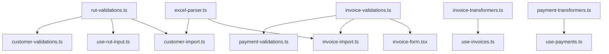

# 📊 Inventario Completo de Tests Unitarios

> Tabla maestra con TODOS los tests pendientes organizados por categoría

## Leyenda

### Estados

- ✅ **Completo** - 100% de tests implementados
- 🟡 **Parcial** - Algunos tests, necesita expansión
- ❌ **Sin tests** - No hay tests para este archivo

### Prioridades

- 🔴 **Crítico** - Impacto financiero/datos
- 🟠 **Importante** - Funcionalidad core
- 🟡 **Deseable** - Nice to have

---

## 📦 Resumen por Categoría

| Categoría                                      | Archivos | Tests   | Horas   | Progreso        |
| ---------------------------------------------- | -------- | ------- | ------- | --------------- |
| [Validaciones](#-validaciones)                 | 6        | 95      | 38      | 0/95 (0%)       |
| [Lógica de Negocio](#-lógica-de-negocio)       | 4        | 62      | 26.7    | 10/62 (16%)     |
| [Hooks Queries](#-hooks-queries)               | 3        | 65      | 40      | 0/65 (0%)       |
| [Hooks Personalizados](#-hooks-personalizados) | 2        | 38      | 20      | 0/38 (0%)       |
| [Formularios](#-formularios)                   | 3        | 52      | 39      | 0/52 (0%)       |
| [Componentes UI](#-componentes-ui)             | 3        | 33      | 20.4    | 0/33 (0%)       |
| [Importación](#-importación)                   | 3        | 63      | 32.4    | 0/63 (0%)       |
| [Transformadores](#-transformadores)           | 3        | 39      | 14.6    | 5/39 (13%)      |
| [Utilidades](#-utilidades)                     | 2        | 20      | 11      | 0/20 (0%)       |
| **TOTAL**                                      | **29**   | **467** | **242** | **15/467 (3%)** |

---

## 🔐 Validaciones

**6 archivos - 95 tests - 38 horas**

| #   | Archivo                                      | Prioridad | Tests | Horas | Estado | Deps              | Notas                            |
| --- | -------------------------------------------- | --------- | ----- | ----- | ------ | ----------------- | -------------------------------- |
| 1   | `lib/rut-validations.ts`                     | 🔴        | 49    | 10    | ✅     | -                 | Validación RUT Chile (rut.js)    |
| 2   | `lib/validations/invoice-validations.ts`     | 🔴        | 25    | 6.25  | ❌     | totals            | Schemas Zod, cálculo IVA         |
| 3   | `lib/validations/customer-validations.ts`    | 🟠        | 20    | 5     | ❌     | rut-validations   | Schemas Zod, RUT                 |
| 4   | `lib/validations/payment-validations.ts`     | 🟠        | 10    | 2.5   | 🟡     | invoice, customer | Ya parcial en use-payments       |
| 5   | `lib/invoice-status.ts`                      | 🟠        | 12    | 3     | ❌     | invoice schema    | Estados de factura (matriz 3×3)  |
| 6   | `lib/validations/installment-validations.ts` | 🟡        | 8     | 2     | ❌     | -                 | Validación de cuotas             |

**Progreso:** 49/95 (52%)

### Orden de Implementación Sugerido

1. rut-validations.ts (base para customer)
2. invoice-validations.ts (base para payment)
3. customer-validations.ts
4. payment-validations.ts (expansión)
5. invoice-status.ts
6. installment-validations.ts

---

## 💰 Lógica de Negocio

**4 archivos - 62 tests - 26.7 horas**

| #   | Archivo                                  | Prioridad | Tests | Horas | Estado | Deps | Notas                          |
| --- | ---------------------------------------- | --------- | ----- | ----- | ------ | ---- | ------------------------------ |
| 7   | `lib/business-logic/installments.ts`     | 🔴        | 20    | 6.7   | 🟡     | -    | Expansión: edge cases redondeo |
| 8   | `lib/business-logic/totals.ts`           | -         | -     | -     | ✅     | -    | YA TESTEADO (181 líneas)       |
| 9   | `lib/business-logic/payment-fifo.ts`     | -         | -     | -     | ✅     | -    | YA TESTEADO (100+ líneas)      |
| 10  | `lib/business-logic/customer-balance.ts` | -         | -     | -     | ✅     | -    | YA TESTEADO (324 líneas)       |
| 11  | `lib/regiones-chile.ts`                  | 🟡        | 10    | 2.5   | ❌     | -    | Helpers regiones/comunas       |
| 12  | `lib/format.ts`                          | -         | -     | -     | ✅     | -    | YA TESTEADO (161 líneas)       |

**Progreso:** 10/62 (16%)

### Orden de Implementación Sugerido

1. installments.ts (expansión de tests existentes)
2. regiones-chile.ts (independiente, simple)

---

## 🔌 Hooks Queries

**3 archivos - 65 tests - 40 horas**

| #   | Archivo                             | Prioridad | Tests | Horas | Estado | Deps                 | Notas                            |
| --- | ----------------------------------- | --------- | ----- | ----- | ------ | -------------------- | -------------------------------- |
| 13  | `hooks/queries/use-invoices.ts`     | 🟠        | 25    | 15    | ❌     | invoice-transformers | Queries, mutations, invalidación |
| 14  | `hooks/queries/use-customers.ts`    | 🟠        | 25    | 15    | ❌     | customer schema      | Queries, mutations               |
| 15  | `hooks/queries/use-installments.ts` | 🟠        | 15    | 10    | ❌     | payment schema       | Queries, mutations               |

**Progreso:** 0/65 (0%)

### Patrón Común

Cada hook necesita tests de:

- Construcción de query params
- Transformación de datos
- Manejo de errores HTTP
- Optimistic updates
- Invalidación en cascada
- Rollback en errores

---

## 🎣 Hooks Personalizados

**2 archivos - 38 tests - 20 horas**

| #   | Archivo                  | Prioridad | Tests | Horas | Estado | Deps            | Notas                         |
| --- | ------------------------ | --------- | ----- | ----- | ------ | --------------- | ----------------------------- |
| 16  | `hooks/use-rut-input.ts` | 🔴        | 20    | 10    | ❌     | rut-validations | Formateo reactivo, validación |
| 17  | `hooks/use-todo-list.ts` | 🟡        | 18    | 6     | ❌     | -               | Modo controlado/no controlado |
| 18  | `hooks/use-debounce.ts`  | -         | -     | -     | ✅     | -               | YA TESTEADO (222 líneas)      |
| 19  | `hooks/use-mobile.ts`    | -         | -     | -     | ✅     | -               | YA TESTEADO (101 líneas)      |

**Progreso:** 0/38 (0%)

---

## 📝 Formularios

**3 archivos - 52 tests - 39 horas**

| #   | Archivo                                         | Prioridad | Tests | Horas | Estado | Deps                   | Notas                             |
| --- | ----------------------------------------------- | --------- | ----- | ----- | ------ | ---------------------- | --------------------------------- |
| 20  | `components/forms/payment-to-customer-form.tsx` | 🔴        | 25    | 18.75 | ❌     | FIFO, allocations      | Distribución FIFO manual          |
| 21  | `components/forms/invoice-form.tsx`             | 🟠        | 15    | 11.25 | ❌     | invoice schema, totals | 3 useEffects: IVA, total, dueDate |
| 22  | `components/forms/payment-to-invoice-form.tsx`  | 🟠        | 12    | 9     | ❌     | invoice, payment       | Auto-completado, validaciones     |

**Progreso:** 0/52 (0%)

### Complejidad

- payment-to-customer-form: ALTA (FIFO + dynamic fields)
- invoice-form: MEDIA (múltiples effects)
- payment-to-invoice-form: BAJA (validaciones simples)

---

## 🎨 Componentes UI

**3 archivos - 33 tests - 20.4 horas**

| #   | Archivo                                              | Prioridad | Tests | Horas | Estado | Deps          | Notas                          |
| --- | ---------------------------------------------------- | --------- | ----- | ----- | ------ | ------------- | ------------------------------ |
| 23  | `components/data-table/data-table.tsx`               | 🟠        | 18    | 10.8  | ❌     | -             | Sorting, filtering, pagination |
| 24  | `components/custom/todo/todo-list.tsx`               | 🟡        | 15    | 9     | ❌     | use-todo-list | Auto-sort, dialogs, focus      |
| 25  | `components/custom/todo/todo-list-field.tsx`         | 🟡        | 10    | 6     | ❌     | todo-list     | React Hook Form integration    |
| 26  | `components/data-table/data-table-column-header.tsx` | 🟡        | 8     | 4.8   | ❌     | data-table    | Sorting UI                     |
| 27  | `components/ui/button.tsx`                           | -         | -     | -     | ✅     | -             | YA TESTEADO (137 líneas)       |
| 28  | `components/ui/card.tsx`                             | -         | -     | -     | ✅     | -             | YA TESTEADO (180 líneas)       |

**Progreso:** 0/33 (0%)

---

## 📥 Importación

**3 archivos - 63 tests - 32.4 horas**

| #   | Archivo                         | Prioridad | Tests | Horas | Estado | Deps                              | Notas                              |
| --- | ------------------------------- | --------- | ----- | ----- | ------ | --------------------------------- | ---------------------------------- |
| 29  | `lib/import/invoice-import.ts`  | 🔴        | 25    | 12.5  | ❌     | invoice-validations, excel-parser | Importación masiva, cálculo IVA    |
| 30  | `lib/import/excel-parser.ts`    | 🟠        | 20    | 10    | ❌     | -                                 | Parsing fechas, decimales, strings |
| 31  | `lib/import/customer-import.ts` | 🟠        | 18    | 9     | ❌     | customer-validations, rut         | Importación clientes, RUT          |

**Progreso:** 0/63 (0%)

### Orden de Implementación Sugerido

1. excel-parser.ts (sin dependencias)
2. customer-import.ts (usa parser + rut)
3. invoice-import.ts (usa parser + invoice validations)

---

## 🔄 Transformadores

**3 archivos - 39 tests - 14.6 horas**

| #   | Archivo                                        | Prioridad | Tests | Horas | Estado | Deps               | Notas                    |
| --- | ---------------------------------------------- | --------- | ----- | ----- | ------ | ------------------ | ------------------------ |
| 32  | `lib/transformers/payment-transformers.ts`     | 🟠        | 15    | 5.6   | 🟡     | payment schema     | Expansión: edge cases    |
| 33  | `lib/transformers/invoice-transformers.ts`     | 🟠        | 12    | 4.5   | ❌     | invoice schema     | parseInvoicesWithBalance |
| 34  | `lib/transformers/installment-transformers.ts` | 🟡        | 12    | 4.5   | ❌     | installment schema | Transformación cuotas    |

**Progreso:** 5/39 (13%)

---

## 🛠️ Utilidades

**2 archivos - 20 tests - 11 horas**

| #   | Archivo                        | Prioridad | Tests | Horas | Estado | Deps   | Notas                   |
| --- | ------------------------------ | --------- | ----- | ----- | ------ | ------ | ----------------------- |
| 35  | `lib/alerts/balance-alerts.ts` | 🟡        | 10    | 5     | ❌     | format | Formateo mensajes Slack |
| 36  | `lib/utils.ts`                 | 🟡        | 10    | 4     | 🟡     | -      | cn() y helpers varios   |

**Progreso:** 0/20 (0%)

---

## 📈 Progreso Global

### Por Prioridad

```
🔴 CRÍTICO (6 archivos)
[█████░░░░░░░░░░░░░░░] 49/145 tests (34%)

🟠 IMPORTANTE (11 archivos)
[██░░░░░░░░░░░░░░░░░░] 15/199 tests (8%)

🟡 DESEABLE (7 archivos)
[░░░░░░░░░░░░░░░░░░░░] 0/83 tests (0%)
```

### Por Categoría

```
Validaciones:           [█████░░░░░] 49/95 (52%)
Lógica de Negocio:      [████░░░░░░] 10/62 (16%)
Hooks Queries:          [░░░░░░░░░░] 0/65 (0%)
Hooks Personalizados:   [░░░░░░░░░░] 0/38 (0%)
Formularios:            [░░░░░░░░░░] 0/52 (0%)
Componentes UI:         [░░░░░░░░░░] 0/33 (0%)
Importación:            [░░░░░░░░░░] 0/63 (0%)
Transformadores:        [██░░░░░░░░] 5/39 (13%)
Utilidades:             [░░░░░░░░░░] 0/20 (0%)
```

---

## ⚡ Quick Actions

### Esta Semana (Fase 1)

- [x] lib/rut-validations.ts (49 tests, 10 hrs) ✅ **COMPLETADO 2025-11-11**
- [ ] lib/validations/invoice-validations.ts (25 tests, 6.25 hrs)
- [ ] lib/business-logic/installments.ts expansión (20 tests, 6.7 hrs)

### Próxima Semana (Fase 2)

- [ ] lib/import/invoice-import.ts (25 tests, 12.5 hrs)
- [ ] hooks/use-rut-input.ts (20 tests, 10 hrs)
- [ ] components/forms/payment-to-customer-form.tsx (25 tests, 18.75 hrs)

### Dependencias Bloqueantes



---

## 📝 Notas

- **Tests YA implementados:** button, card, use-debounce, use-mobile, use-payments, format, totals, customer-balance, payment-fifo
- **Cobertura actual:** ~30% (enfocada en lógica crítica)
- **Herramientas:** Vitest 1.6 + React Testing Library 16.2
- **Environment:** jsdom

---

**Última actualización:** 2025-11-11
